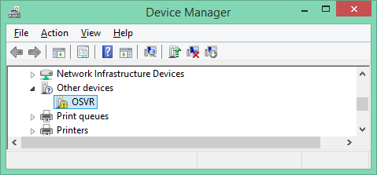
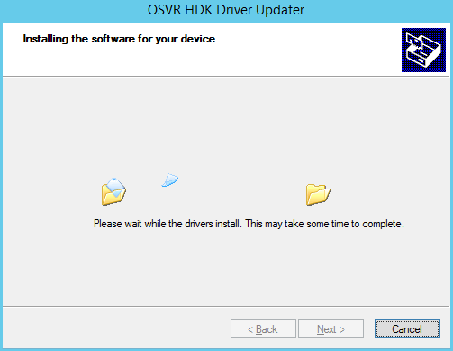
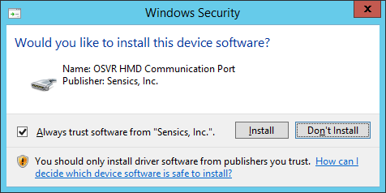
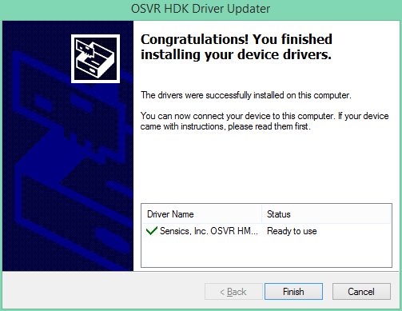
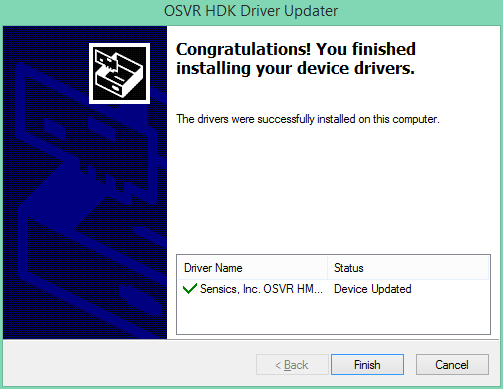
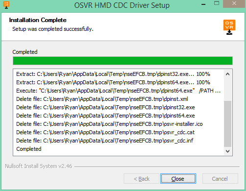
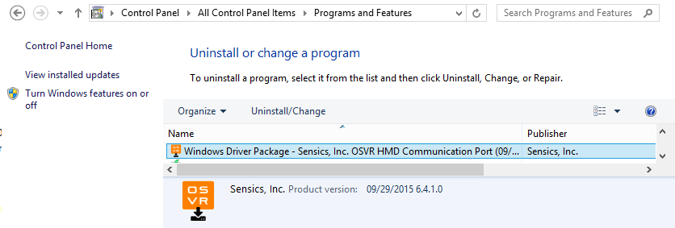

# HDK CDC driver installer instructions

You can use this installer if:

- Your computer is running Windows XP through Windows 8.1 - it's not needed on Windows 10, Mac, or Linux (all those platforms include a "USB CDC" device class driver).
- Your computer isn't based on an ARM or Itanium processor. (If you don't know, you almost certainly aren't - ARM is mobile or Windows RT, Itanium is really expensive specialized servers. x86 and x64 aka x86_64 aka AMD64 aka EM64T are all fine with the installer.)

If you are using an ARM or Itanium machine on XP through 8.1, or you just want to do things the hard (manual) way, you're welcome to download the zip file: it contains the bare `.inf` and corresponding `.cat` file that you can either install by choosing "Update driver" and eventually "Have Disk" on the "Unknown Device" in the device manager, or by adding to your driver cache with `pnputil` on Vista or newer. (It's just one `.inf` and one corresponding signed `.cat` file for all architectures, since we actually just have to tell Windows to use its built-in USB serial/CDC driver with this particular hardware ID, and so there are no per-architecture files in the "driver".)

This driver is needed for the OSVR communication port ("USB CDC device") used by the OSVR control tool that can update firmware, change internal settings on the HDK, etc. It's not needed for normal operation - tracking data goes over USB HID which does not need a separate driver, and the "unknown device" that appears without this driver installed does not cause any problems.

It does not matter if the HDK is plugged in or not, the installer should work either way, putting the driver into your system driver store so whenever you plug in an HDK, Windows knows what to do with the USB CDC device.

## The "Before" photo
Here's the USB CDC device masquerading as an "Unknown Device" as seen on Windows 8.1 before installing the driver.

Harmless, but no good for firmware upgrades. Read on...

## The step by step

All screenshots were taken on an x64 install of Windows 8.1 (or its server equivalent Server 2012 R2), but should be pretty similar, aside from Microsoft's changing visual tastes, on all supported systems.

### Download and run `OSVR-HMD-CDC-Driver.exe`

Get the latest version of that file from the [HDK Drivers Releases page](https://github.com/OSVR/OSVR-HDK-Windows-Drivers/releases) and run it.

You'll most likely see a User Account Control prompt confirming that you want to run the application with admin privileges, and confirming that it's signed by [Sensics, Inc.][sensics] Click yes. (For security reasons, they don't make it easy to take a screenshot of that screen...)

**Note:** If you want to be super-stealthy and pop up few, if any, dialogs, you can run the installer on a command prompt, preferably an administrator command prompt, and pass the argument `/S` - case-sensitive! - to enable silent mode. If you haven't already installed a Sensics, Inc. driver and chosen to "Always trust software from Sensics, Inc.", you'll still get the pop-up mentioned below under "security prompt"

### Step through the wizard, starting page

Here's the first screen, same for everyone. The specifics mentioned in the details of the background window will vary. Go ahead and **click next** to perform the actual driver installation.

(It's normal that it looks like there are two installers - one is acting as a glorified self-extracting zip file wrapping the driver and a standard Microsoft-provided driver install tool called `dpinst`. There will only be one entry in "Programs and Features" aka "Add/Remove Programs".)

### Step through the wizard: copying files

**Nothing to do on this screen...**

Often this screen flips by very quickly, far too quickly to get a screenshot, unless this is the first time you're installing a Sensics-signed driver on this Windows installation...

### Step through the wizard: security prompt if you haven't been here before

If this is the first driver signed by [Sensics, Inc.][sensics] that you've installed (or if you didn't leave "Trust this publisher" checked last time), Windows will prompt you to confirm that you want to do the driver install.

It should show a driver package name something similar to "OSVR HMD Communication Port" and that the driver is signed by the publisher, [Sensics, Inc.][sensics]. This verifies that it hasn't been modified and assuaging Microsoft's varying signed-driver requirements across Windows versions and architectures. No backflips required - Sensics paid the dues to be able to sign installers, apps, and drivers. (See note at the bottom of this page regarding driver signing if you're worried about how driver signing interacts with the open-source-ness of all this.)

**If you get this dialog, just click "Install" after verifying that it looks how you expect. If you don't get it, no worries, carry on...**

### Step through the wizard: mostly done!

What you'll see here depends on whether the HDK was plugged in or not during the install, though the end result is the same: now and in the future, plugging in the HDK will result in Windows using the newly-installed driver, instead of being flummoxed as it was before.

**In all cases, go ahead and click Finish.**

#### Choose your adventure, outcome number one

If the HDK was unplugged, then Windows placed the driver in its driver store, ready to use it next time you plug in the HDK, and you'll see something like this:

(That's also what you'll see if you already had the drivers installed, but had the HDK unplugged during install. Don't worry, it didn't change anything or add an extra uninstall entry.)

#### Choose your adventure, outcome number two

If you had the HDK plugged in, then Windows was able to not only update the driver store, but also apply the driver to a device! Very exciting! You'll see this screen:

#### Choose your adventure, outcome number three

If you were wondering how well I tested this and tried installing the (same-version) drivers again when they were already installed, and had the HDK plugged in, then you'll see this screen:

Don't worry, as in outcome one's repeated install case, it didn't change anything or add an extra uninstall entry. Fortunately for us all, `DPInst` appears to be effectively [idempotent](http://stackoverflow.com/a/1077421/265522).

### Step through the wizard: one last button

You'll now be left at the "outer" installer's final screen, with some essentially-useless details (that will undoubtedly vary from the screenshot) about its actions, and a Close button standing between you and having fully completed the install.

**Just click Close.**

## Now that you've installed the driver...

### Look, a driver!

When you have the HDK plugged in, you'll notice the Device Manager entry with the OSVR unknown device should be gone, replaced by an entry under "Ports" that will resemble the following (almost certainly differing in port number, which should not matter):

If for some reason this is *not* the case, see the Troubleshooting section.

### Would you like to undo your work?

The entry in the "Programs and Features" control panel (formerly known as "Add/Remove Programs") will look something like the following. If you choose to uninstall this tiny little inf file for some reason (like driver testing, or making screenshots for a tutorial), for best results **unplug the HDK before clicking "Uninstall"** on that entry.

## Troubleshooting
The driver has been tested, but it's impossible to test all potential cases. If you run into trouble *related to the USB CDC "Communication Device" on the HDK* (Unknown Device OSVR still showing up, some error in the device manager on the port), first, try to fix it:

- Unplug and replug the HMD and all its connections (which will also cycle the power). *If this fixes it, let us know - see the following section.*
- If there are any hubs or USB extension cables between the computer and the HDK, try not using them (plugging directly in). *If this fixes it, let us know - see the following section.*
- Try rebooting - it is Windows, after all. ;-)
- After taking a screenshot of Device Manager that shows the problem, unplug the HDK, uninstall the driver package (see above), plug the HDK in, right click the device that appears (will probably be Unknown Device - OSVR), choose Uninstall, and check the box to remove the drivers for the device as well, then unplug and try installing the device again. *If this fixes it, let us know - see the following section.*

### Get in touch

If the steps above don't help, or if they told you to let us know that a particular problem happened and was resolved:

**Describe the situation**: the more we know about your hardware and software environment, the better.

- Symptoms of the problem
- Screenshot of affected part of Device Manager, if possible/applicable
- Make and model of computer
- Operating system version and platform (64-bit, etc)
- Type and location of USB port plugged into (2.0 vs 3.0, front-panel, top, rear-panel, right or left side)
- Whether the original cables that came with the HDK were being used
- Whether any USB extension cables, hubs, or switches were between the HDK and the computer (and if so, what kind)
- If known, version of HDK, version of HDK firmware, and the numbers on the side of the box the HDK came in (model, serial, etc.)

**Gather the geeky details**: there are logs and other information that can help us pinpoint the problem.

We have a script that will bundle up all those things into one text file, at least if you're on Win7 or newer. It's called `gather-driver-troubleshooting-logs.cmd`. Download and run it (make sure it stays ending in `.cmd` - some browsers like to rename files that look like text) - it will give you some instructions and generate a `driver-troubleshooting-logs.txt` file. Attach that generated file to an email containing

## An aside about open-source, this driver, and Windows driver signing

Code signing and digital signatures are a way of asserting, through use of cryptographic certificates, that an identified entity in some way approved a piece of code, driver, etc. and that the file(s) signed have not been changed since they were signed. They're widely used in many places and projects, including fully open-source operating systems, so they aren't incompatible with open source in concept or even in practice; however, the details of how the vendors of some platforms have chosen to implement, apply, and enforce code signing may make it harder to exercise the freedoms offered by open-source licenses.

Various Microsoft operating systems strongly encourage, or even enforce (to varying degrees of strictness), that drivers installed on a system carry a digital signature from an entity possessing a code-signing certificate issued by a certificate authority (CA) approved by Microsoft specifically for code-signing purposes (the list of such CAs is much shorter than the list approved as root CAs to provide encrypted web traffic, aka HTTPS). To provide a smooth user experience for the vast majority of users, Sensics, Inc. has acquired such a code-signing certificate and signs these released drivers.

Multiple levels of code in the USB CDC driver installer are signed with this certificate to reduce the number of "scary warnings" presented during the user experience. However, the most important signature (and the one Windows demands) is on/in the `.cat` file, which contains a cryptographic hash of the contents of the corresponding `.inf` file at the time of signing, effectively tying the signature to the exact contents of both files. This signature is thus rendered invalid if the `.inf` file is modified, so users of a modified `.inf` may have to sign a new `.cat` file themselves (whether with a full or test-signing certificate) or bypass Microsoft's driver signing enforcement, what I've collectively referred to as "backflips" elsewhere in this document.

Note, however, that despite the fact that this digital signature "breaks" if the driver is modified, *the driver is open-source*, under the Apache Software License version 2.0 (granting you freedoms subject to the terms found in that license), and contributions are welcome as a community project. (You can think about it this way: Your ability to exercise permissions under the license is not diminished by the presence of the signature; it's just that if a particular kind of signature, from Sensics or otherwise, wasn't present on release files, *all* users would have to go through technological backflips to install the driver on their Microsoft operating system, instead of just users of modified versions that haven't been incorporated upstream or signed by a downstream fork.)

That said,

- The OSVR HDK's USB CDC driver is, by design, a pretty simple driver, and there's probably not much interesting to do with it in terms of contributions, though good surprises are always welcome.
    - Because of Microsoft driver signing requirements, contributors will generally need to do the typical Windows test-signing backflips to test their work during development.
    - At this time, it is planned that tested and accepted (merged) contributions will result in an update of the signature on the driver in the repository, as a service to the OSVR community by [Sensics][sensics] as OSVR founding member and steward. (Fine print, lest you consider this a point to argue over: This does not imply an obligation to do so for any particular contribution or at any particular date in the future - consider it as "Sensics being open-source-savvy and doing a favor to do right by the community". Certificates expire, conditions on participating in vendor-specific signing programs change, business situations change, etc.)
- Probably the most interesting "open-source-enabled" thing to do with this driver is modify it for use with your own USB-connected project, as it's the simplest, most MS-recommendation-following, and most liberally-licensed CDC inf I've found. It was composed from scratch, from documentation rather than copied-and-pasted examples, and thus was able to be licensed cleanly under Apache 2.0. (Yes, I'm a little bit proud of it :D Happy to have a good outcome after so much Windows-wrestling.)
    - Re-use and modification for your own project, provided you follow the Apache 2.0 license, is welcome, though do be courteous and use your own VID/PID for your own devices.
    - Note, of course, that changing any part of the `.inf`, including the VID/PID, will invalidate the `.cat` and the signature, so users of your modified version will either have to do the aforementioned backflips, or you'll have to make a new `.cat` (script included in the repo) and sign it with your own Microsoft-driver-approved code-signing certificate.

It should go without saying, because this is the Internet, but to be clear: **I am not a lawyer, and nothing here is legal advice**. Read the license, it's a common-enough one to be worth knowing. If you have a legal question, ask a lawyer. I am also not speaking for Microsoft, nor am I even an expert at their hardware and driver approval policies, I'm just someone who followed the documentation, made an `.inf`, experimented and debugged until it worked, then followed the documentation again to get a proper signature. If you have a question about Microsoft's driver signing process, policies, or enforcement, ask Microsoft.

[sensics]: http://sensics.com/osvr
